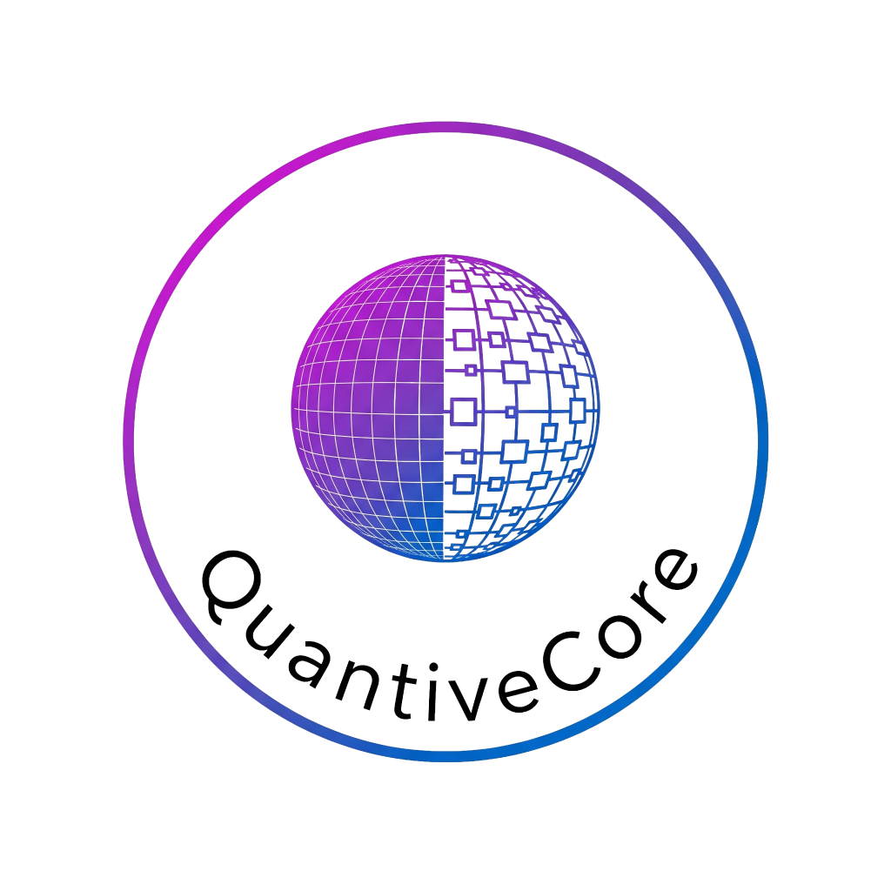

<div align="center">
  

  # QuantiveCore

  **Production-grade bit-level GEMM engine for binary & ternary neural networks**

  [](https://github.com/pomaieco/quantivecore/releases)
  [](https://isocpp.org/)
  [](https://cmake.org/)
  [](go/)
  [](LICENSE)
  [](https://discord.gg/nnkfW83n)
</div>

---

## 🚀 What is QuantiveCore?

QuantiveCore is a high-performance, production-grade **binary and ternary GEMM (General Matrix Multiplication)** engine with a stable C ABI. It is designed for edge inference workloads where efficient bit-level computation is critical, delivering extreme speed with a minimal memory footprint compared to traditional floating-point operations.

**Key highlights:**
- ⚡ AVX2 / AVX-512 / AMX hardware dispatch paths
- 🔒 Stable, frozen C ABI for 1.x (safe to link as a shared library)
- 🧵 NUMA-aware threadpool with performance counter integration
- 🔁 Reproducible builds for deterministic CI pipelines
- 📦 Both static and shared library targets
- 🌐 Go language wrapper included

---

## 📋 Requirements

| Tool | Minimum Version |
|------|----------------|
| CMake | 3.20 |
| C++ Compiler | GCC 11 / Clang 13 (C++20) |
| Go *(optional)* | 1.21 |

> **Note:** AVX2 is required for optimised paths. AVX-512 and AMX are optional and auto-detected at compile time.

---

## 🛠️ Build & Install

### Quick Build

```bash
cmake -S . -B build
cmake --build build -j$(nproc)
ctest --test-dir build --output-on-failure
```

### Install to System

```bash
cmake -S . -B build-release -DCMAKE_BUILD_TYPE=Release
cmake --build build-release -j$(nproc)
sudo cmake --install build-release
```

### Reproducible Build

```bash
export SOURCE_DATE_EPOCH=1700000000
cmake -S . -B build-r1 -DQC_REPRODUCIBLE=ON
cmake --build build-r1 -j$(nproc)
```

### CMake Options

| Option | Default | Description |
|--------|---------|-------------|
| `QC_ENABLE_AVX512` | `ON` | Enable AVX-512 dispatch paths |
| `QC_ENABLE_AMX` | `ON` | Enable AMX dispatch paths |
| `QC_REPRODUCIBLE` | `OFF` | Deterministic/reproducible build |
| `QC_BUILD_EXAMPLES` | `ON` | Build deployment examples |
| `QUANTCORE_ENABLE_ASAN` | `OFF` | AddressSanitizer |
| `QUANTCORE_ENABLE_UBSAN` | `OFF` | UndefinedBehaviorSanitizer |
| `QUANTCORE_ENABLE_TSAN` | `OFF` | ThreadSanitizer |

---

## 📐 Stable ABI

Only **`include/quantcore/c_api.h`** is ABI-stable for the entire 1.x series. You may safely link against the shared library without recompiling your application across patch and minor releases.

**Exported symbols:**

```c
const char* qc_version(void);
void qc_binary_gemm(...);
void qc_ternary_gemm(...);
```

---

## 🔗 Usage Examples

### C++ — Direct API

```cpp
// See: examples/simple_inference.cpp
#include <quantcore/c_api.h>

// Run a binary GEMM kernel
qc_binary_gemm(A, B, C, M, K, N);
```

### Go — Language Wrapper

```go
// See: examples/go_inference_example/main.go
import "quantivecore/go"

result := quantcore.BinaryGEMM(a, b, m, k, n)
```

---

## 📊 Performance

Baseline regression data is tracked in [`bench/regression_baseline.json`](bench/regression_baseline.json).  
A CI regression gate enforces that performance does not regress between releases (binary GEMM at 2048×2048).

Run benchmarks locally:

```bash
cmake -S . -B build-bench -DCMAKE_BUILD_TYPE=Release
cmake --build build-bench -j$(nproc) --target bench_gemm
./build-bench/bench_gemm
```

---

## 📦 Package Integration (pkg-config)

After installing, use pkg-config to integrate into your build system:

```bash
pkg-config --cflags --libs quantcore
```

---

## ✅ Release Checklist (v1.0.0)

- [x] C ABI frozen
- [x] Shared/static packaging + pkg-config
- [x] Sanitizer jobs configured
- [x] Cross-platform CI matrix configured
- [x] Go wrapper includes `BinaryGEMM`, `TernaryGEMM`, `Version`
- [x] Reproducible build check configured

---

## 📁 Project Structure

```
quantivecore/
├── include/quantcore/   # Public headers (c_api.h is ABI-stable)
├── src/                 # Implementation sources
├── tests/               # Unit, property, and integration tests
├── bench/               # Benchmark harness & baseline data
├── examples/            # C++ and Go usage examples
├── go/                  # Go language wrapper
└── docs/                # Additional documentation
```

---

## 📄 License

QuantiveCore is released under the **Non-Commercial Open-Source License (NC-OSL) v1.0**.

- ✅ Free to use, copy, modify, and distribute for non-commercial purposes
- ✅ Derivative works must be open-sourced under the same license
- ❌ Commercial use is **not permitted** without a separate written license

See [LICENSE](LICENSE) for full terms.  
For commercial licensing inquiries, contact the copyright holder.

---

<div align="center">
  <sub>© 2026 Pomai / Pomaieco · Built with ❤️ for efficient neural inference</sub>
</div>
